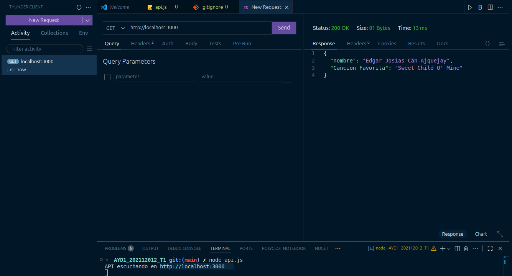
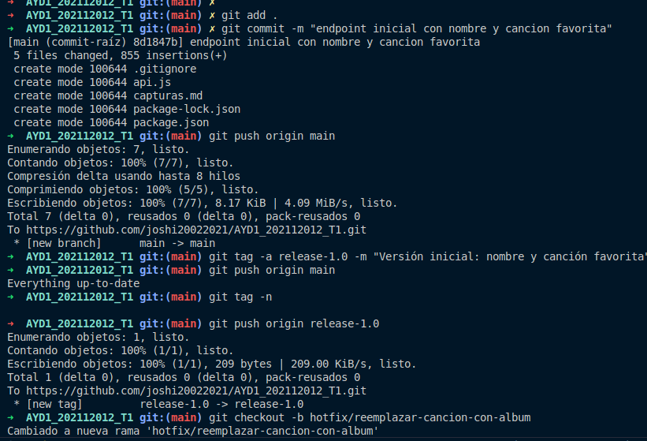
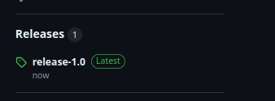
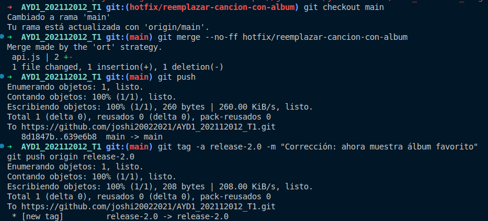
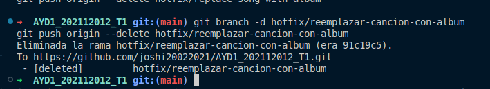

# Evidencias de la Tarea

Este documento muestra las capturas de los pasos realizados en la tarea.

---

## 📌 Captura 1
creación del repositorio, API inicial corriendo.

---
## 📌 Captura 2
creacion de commit y release 1

---

## 📌 Captura 3
release 1

---

## 📌 Captura 4
creacion de rama hotfix y release 2

---

## 📌 Captura 5
borrar rama hotfix

